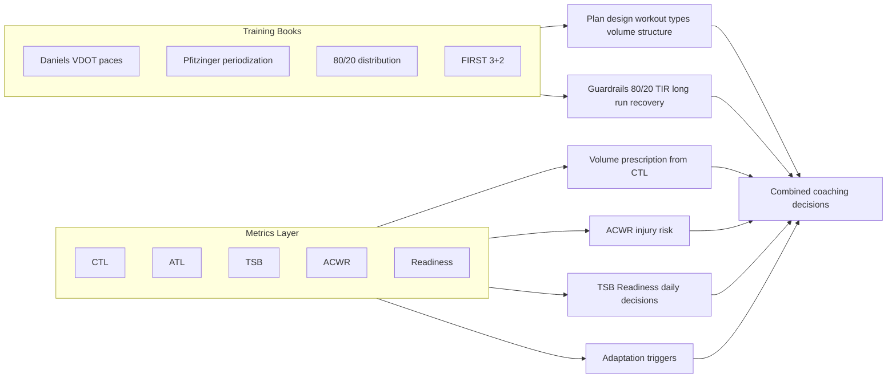

# Sports Coach Engine: Training Methodology (Expert Review Draft)

**Purpose**: This document describes the training methodology currently implemented in Sports Coach Engine, the relationship between classic training literature and the quantitative metrics we use, and open questions for review by a sport coaching expert.

**Audience**: Sport coaching experts, physiologists, and internal reviewers.

**Cross-check**: Definitions, zones, thresholds, guardrails, and adaptation triggers have been verified against [methodology.md](methodology.md) and the codebase. Equations, constants, and conditions in §3.4, §4.2–4.3, §6.2, and §7 are taken directly from [sports_coach_engine/core](../../../sports_coach_engine/core) and related schemas.

---

## 1. Executive Summary

Sports Coach Engine combines:

- **Training philosophy and workout design** from established running texts: Daniels' Running Formula, Pfitzinger's Advanced Marathoning / Faster Road Racing, Matt Fitzgerald's 80/20 Running, and FIRST (Run Less, Run Faster).
- **Quantitative load and readiness metrics** from the Banister/TrainingPeaks tradition: Chronic Training Load (CTL), Acute Training Load (ATL), Training Stress Balance (TSB), Acute:Chronic Workload Ratio (ACWR), and a composite Readiness score.

The books do **not** define or use CTL/ATL/TSB/ACWR. Those metrics are used by the system to: (1) set appropriate training volume from current fitness (CTL), (2) manage injury risk (ACWR), (3) assess daily readiness and form (TSB, Readiness), and (4) trigger adaptation suggestions (e.g. downgrade or move a workout). The books provide pace zones, periodization, intensity distribution rules (80/20), workout types, and safety guardrails; the metrics layer provides the numbers that drive volume prescription, progression safety, and day-to-day adaptation.

---

## 2. What the Training Books Provide (and Do Not Provide)

### 2.1 Sources

- **Daniels' Running Formula**: VDOT and pace zones (E, M, T, I, R), volume limits for quality work (T ≤10% weekly, I ≤8%/10 km, R ≤5%/8 km), philosophy (consistency, train at current fitness, 3–4 weeks before stress increase).
- **Pfitzinger (Advanced Marathoning / Faster Road Racing)**: Periodization (base → build → peak → taper), long run progression and caps (≤25–30% weekly, ≤2.5 h), recovery weeks (every 4th week ~70% volume), hard/easy principle, workout definitions (LT runs, VO2max intervals, long run, marathon-pace runs).
- **80/20 Running (Matt Fitzgerald)**: Intensity distribution (~80% low, ≤20% moderate+high), avoidance of "moderate-intensity rut," minimum three runs per week when using cross-training, workout constructors (foundation, tempo, intervals, etc.).
- **FIRST (Run Less, Run Faster)**: 3-plus-2 structure (three key runs + cross-training), pace from recent 5K, quality-focused low frequency; used when running 2–3 days/week and for multi-sport volume planning.

### 2.2 What the Books Do NOT Provide

None of these books define or use:

- Chronic Training Load (CTL) or 42-day exponential averages
- Acute Training Load (ATL) or 7-day exponential averages
- Training Stress Balance (TSB)
- Acute:Chronic Workload Ratio (ACWR)
- A composite "readiness" score

Those concepts come from the Banister fitness–fatigue model and its popularization in tools like TrainingPeaks (Performance Management Chart). We use them as a **separate, quantitative layer** on top of the book-based methodology.

---

## 3. Metrics Layer: Origin, Definitions, and Role

### 3.1 Origin

- **CTL, ATL, TSB**: Exponentially weighted moving averages of daily training load, with time constants (e.g. 42 days for CTL, 7 days for ATL). Standard in TrainingPeaks and related literature; see e.g. TrainingPeaks Help (Fitness/CTL, Fatigue/ATL, Form/TSB).
- **ACWR**: Acute (e.g. 7-day) load divided by chronic (e.g. 28-day) load. Used in sports science for injury risk; 1-week acute / 4-week chronic is common; ACWR >1.5 often associated with elevated injury risk in studies.

### 3.2 Definitions in Our System

| Metric        | Definition                                                                 | Represents                                  |
| ------------- | -------------------------------------------------------------------------- | ------------------------------------------- |
| **CTL**       | 42-day EWMA of daily systemic load                                         | "Fitness" – aerobic base, training capacity |
| **ATL**       | 7-day EWMA of daily systemic load                                          | "Fatigue" – recent training stress          |
| **TSB**       | CTL − ATL                                                                  | "Form" – balance of fitness vs fatigue      |
| **ACWR**      | (7-day average daily systemic load) / (28-day average daily systemic load) | Injury risk from load spikes                |
| **Readiness** | Weighted composite (see §3.4 and §6)                                       | Daily go/no-go and intensity guidance       |

**Zone boundaries (as implemented in code):**

- **CTL zones** ([metrics.py](../../../sports_coach_engine/core/metrics.py) `_classify_ctl_zone`): &lt;20 Beginner, &lt;40 Developing, &lt;60 Recreational, &lt;80 Trained, &lt;100 Competitive, ≥100 Elite.
- **TSB zones** ([metrics.py](../../../sports_coach_engine/core/metrics.py) `_classify_tsb_zone`): &lt;−25 Overreached, −25 to &lt;−10 Productive, −10 to &lt;+5 Optimal, +5 to &lt;+15 Fresh, ≥+15 Peaked.
- **ACWR zones** ([metrics.py](../../../sports_coach_engine/core/metrics.py) `_classify_acwr_zone`): &lt;0.8 Undertrained, 0.8–&lt;1.3 Safe, 1.3–&lt;1.5 Caution, ≥1.5 High risk. Internal flag `injury_risk_elevated = True` when ACWR &gt; 1.3.

### 3.3 How We Use These Metrics

- **Plan design**: Starting and target volume are informed by current CTL (e.g. safe volume range from `sce guardrails safe-volume --ctl X`). Goal feasibility (e.g. marathon) can consider CTL and weeks until race.
- **Injury prevention**: ACWR drives adaptation triggers (e.g. ACWR >1.5 → high risk; >1.3 → caution). We do not auto-downgrade; the AI presents options and reasoning.
- **Daily readiness**: TSB and Readiness inform whether to proceed with a quality session, downgrade, or rest. Safety override: ACWR >1.5 and Readiness <35 can force a rest day.
- **Multi-sport**: Two-channel load (systemic vs lower-body) gates running quality/long runs by lower-body load; systemic load feeds CTL/ATL/TSB/ACWR so all sports contribute to fitness and fatigue.

### 3.4 Implementation Reference (Code-Accurate)

All formulas and constants below are taken from [sports_coach_engine/core/metrics.py](../../../sports_coach_engine/core/metrics.py). These are the exact equations and conditions used in the package.

**CTL / ATL / TSB**

- **Constants**: `CTL_DECAY = 0.976` (42-day time constant: 1 − 1/42), `CTL_ALPHA = 0.024`. `ATL_DECAY = 1 − 1/7 ≈ 0.8571`, `ATL_ALPHA = 1/7 ≈ 0.1429`.
- **Equations** (day _t_):
  - `CTL(t) = CTL(t−1) × 0.976 + daily_systemic_load(t) × 0.024`
  - `ATL(t) = ATL(t−1) × 0.8571 + daily_systemic_load(t) × 0.1429`
  - `TSB(t) = CTL(t) − ATL(t)`
- **Cold start**: If no previous day metrics exist, baseline CTL/ATL are estimated from the **next** 14 days of load: `estimated_ctl = estimated_atl = mean(systemic_load over those 14 days)` (steady-state assumption). Source: `estimate_baseline_ctl_atl(..., lookback_days=14)`.
- **CTL trend** (optional): `ctl_change_7d = CTL(t) − CTL(t−7)`. If `ctl_change_7d > 2.0` → "building"; if `< −2.0` → "declining"; else "maintaining".

**ACWR**

- **Condition**: ACWR is **not** computed if fewer than 28 days of historical daily metrics exist (including day *t*−1 through *t*−28). Source: `ACWR_MINIMUM_DAYS = 28`; `calculate_acwr` returns `None` if any of those 28 days is missing.
- **Data used**: For day _t_, we use metrics from days *t*−1 to *t*−28 (not including _t_). `acute_7d = sum(systemic_load_au)` for days *t*−1…*t*−7. `chronic_28d_total = sum(systemic_load_au)` for days *t*−1…*t*−28.
- **Formula**: `chronic_28d_avg = chronic_28d_total / 28`, `acute_7d_avg = acute_7d / 7`, **ACWR = acute_7d_avg / chronic_28d_avg**. (Rolling 7-day and 28-day windows; not EWMA.)
- **Injury flag**: `injury_risk_elevated = (acwr > 1.3)`.

**Baseline and data sufficiency**

- `BASELINE_DAYS_THRESHOLD = 14`: `baseline_established = (data_days >= 14)` where `data_days` = count of days with metrics in the last 60 days (excluding today).
- Historical days are counted backward from `target_date` (the day for which metrics are being computed); today is not included.

**Validation (sanity checks)** ([metrics.py](../../../sports_coach_engine/core/metrics.py) `validate_metrics`): Warnings are raised if: CTL &lt; 0 or &gt; 200; ATL &lt; 0 or &gt; 300; TSB &lt; −100 or &gt; 50; ACWR &lt; 0.2 or &gt; 3.0; readiness &lt; 0 or &gt; 100; negative daily loads; or readiness component weights do not sum to 1.0 (tolerance 0.01). These are internal sanity checks, not athlete-facing rules.

---

## 4. Load Model: Two Channels and Base Effort

### 4.1 Two-Channel Model

- **Systemic load** (`systemic_load_au`): Drives CTL, ATL, TSB, ACWR. All activities contribute via sport-specific multipliers. Formula per activity: `systemic_load_au = base_effort_au × systemic_multiplier` (after interval adjustment).
- **Lower-body load** (`lower_body_load_au`): Used to gate running quality and long runs. Formula: `lower_body_load_au = base_effort_au × lower_body_multiplier`. Threshold for gating: see §7.2 (lower-body load trigger).

**Sport multipliers (exact, from [load.py](../../../sports_coach_engine/core/load.py) `DEFAULT_MULTIPLIERS`)** — (systemic, lower_body):

| Sport         | Systemic | Lower-body |
| ------------- | -------- | ---------- |
| Run           | 1.0      | 1.0        |
| Trail_run     | 1.05     | 1.10       |
| Treadmill_run | 1.0      | 0.9        |
| Track_run     | 1.0      | 1.0        |
| Cycle         | 0.85     | 0.35       |
| Swim          | 0.70     | 0.10       |
| Climb         | 0.60     | 0.10       |
| Strength      | 0.55     | 0.40       |
| CrossFit      | 0.75     | 0.55       |
| Yoga          | 0.35     | 0.10       |
| Hike          | 0.60     | 0.50       |
| Walk          | 0.40     | 0.30       |
| Other         | 0.70     | 0.30       |

Running surface overrides (when sport is Run): Treadmill → lower_body 0.9; Trail → systemic 1.05, lower_body 1.10; Track → unchanged.

### 4.2 Base Effort (Implementation vs Documentation)

**Current implementation** (see [sports_coach_engine/core/load.py](../../../sports_coach_engine/core/load.py)): Base effort is computed with a **TSS-equivalent** formula aligned with TrainingPeaks/Coggan.

**Formula**: `base_effort_au = hours × IF² × 100`, where `hours = duration_minutes / 60` and IF comes from the RPE→IF table below. Function: `calculate_base_effort_tss(rpe, duration_minutes)`.

**RPE → IF mapping (exact, from code)**:

| RPE | IF   | Zone / intent           |
| --- | ---- | ----------------------- |
| 1   | 0.50 | Recovery (Zone 1)       |
| 2   | 0.55 | Very easy               |
| 3   | 0.65 | Easy (Zone 2)           |
| 4   | 0.75 | Moderate easy           |
| 5   | 0.82 | Steady state (Zone 3)   |
| 6   | 0.88 | Tempo (Zone 3 upper)    |
| 7   | 0.95 | Threshold (Zone 4 – LT) |
| 8   | 1.00 | Threshold high          |
| 9   | 1.05 | VO2max (Zone 5)         |
| 10  | 1.10 | Max effort              |

Default for unknown RPE: `IF = 0.70`. Result is rounded to 1 decimal place.

**Examples**: 60 min at RPE 3 → (1 × 0.65² × 100) ≈ 42.3 AU. 60 min at RPE 8 → 100.0 AU.

**Interval adjustment** ([load.py](../../../sports_coach_engine/core/load.py) `adjust_tss_for_intervals`): If the activity is detected as interval work (keywords: "interval", "repeat", "rep", "x ", "@ "; or Strava workout_type == 3; or session_type QUALITY/RACE), base TSS is multiplied by **0.85** (−15%) before applying sport multipliers. Explanation: work:rest recovery reduces effective stress.

**Session type classification** ([load.py](../../../sports_coach_engine/core/load.py) `classify_session_type`): Strava `workout_type == 1` (race) → RACE. Else: RPE 1–4 → EASY, 5–6 → MODERATE, 7–8 → QUALITY, 9–10 → RACE.

**Multiplier adjustments** ([load.py](../../../sports_coach_engine/core/load.py) `adjust_multipliers`): (1) **Strength**: if name/description contains leg keywords (leg, squat, deadlift, lunge, lower body) → lower-body +0.25; if upper-body keywords (upper body, bench, pull-up, shoulder, chest, back) → lower-body = max(0.15, lower_body − 0.15). (2) **Elevation**: if elevation_gain_m / (distance_m/1000) > 30 m/km → systemic +0.05, lower-body +0.10. (3) **Duration**: if duration_minutes > 120 → systemic +0.05. (4) **Race**: if workout_type == 1 → systemic +0.10.

**Surface overrides for running** ([load.py](../../../sports_coach_engine/core/load.py) `get_multipliers`): Treadmill → lower-body 0.9; Trail → systemic 1.05, lower-body 1.10; Track → no change (1.0, 1.0).

### 4.3 RPE Estimation (Inputs to Load)

RPE used for base effort can come from multiple sources. The package **does not** resolve conflicts; it returns all estimates and the AI/athlete chooses. Source order in the code ([notes.py](../../../sports_coach_engine/core/notes.py) `estimate_rpe`): (1) Explicit user input (Strava `perceived_exertion`), (2) HR-based estimate, (3) Strava relative effort (`suffer_score`), (4) Pace-based estimate (running + VDOT in profile), (5) Duration heuristic (fallback).

**HR-based RPE** ([notes.py](../../../sports_coach_engine/core/notes.py) `estimate_rpe_from_hr`): Uses `max_hr = athlete_max_hr or max_hr_activity`. **Percent-of-max zones** (exact boundaries):

| % max HR  | Base RPE | Label                 |
| --------- | -------- | --------------------- |
| &lt; 60   | 2        | Very easy             |
| 60–&lt;68 | 3        | Easy recovery         |
| 68–&lt;78 | 4        | Easy/aerobic (Zone 2) |
| 78–&lt;85 | 5        | Moderate/tempo        |
| 85–&lt;90 | 6        | Lactate threshold     |
| 90–&lt;94 | 7        | VO2max lower          |
| 94–&lt;97 | 8        | VO2max upper          |
| ≥ 97      | 9        | Anaerobic/maximal     |

**Duration adjustment** (HR-based only): If `duration_minutes > 90` and `base_rpe >= 4` → +1 RPE; if `> 150` → +2 RPE; if `> 240` (4 h) → +3 RPE. Cap: `final_rpe = min(10, base_rpe + duration_adjustment)` (adjustment itself is capped at 3).

**Strava relative effort** ([notes.py](../../../sports_coach_engine/core/notes.py) `estimate_rpe_from_strava_relative`): `effort_per_min = suffer_score / duration_minutes`. Mapping: &lt;0.5 → RPE 2, &lt;1.0 → 4, &lt;1.5 → 5, &lt;2.0 → 6, &lt;2.5 → 7, &lt;3.0 → 8, else 9.

**Pace-based RPE** ([notes.py](../../../sports_coach_engine/core/notes.py) `estimate_rpe_from_pace`): Uses VDOT from profile. Zone paces (seconds per km): Easy = 360 − (VDOT − 40)×6; Tempo = 330 − (VDOT − 40)×5; Interval = 300 − (VDOT − 40)×5.5; Marathon ≈ (easy + tempo)/2; Repetition = interval − 30. Then: pace ≤ repetition → RPE 9, ≤ interval → 8, ≤ tempo → 7, ≤ marathon → 6, ≤ easy → 4; slower → 3. Trail_run adds +1 RPE.

**Duration heuristic** ([notes.py](../../../sports_coach_engine/core/notes.py) `estimate_rpe_from_duration`): Sport defaults (e.g. run 5, trail_run 6, cycle 4, climb 6, strength 6, yoga 2). If duration_minutes > 120, `base_rpe = min(10, base_rpe + 1)`.

---

## 5. Data Requirements for Valid Metrics

### 5.1 Minimum History

- **CTL**: Time constant 42 days (code: `CTL_DECAY = 0.976`, `CTL_ALPHA = 0.024`). TrainingPeaks states that "it takes 42 days to get concrete CTL when starting fresh"; we document a **minimum of 12 weeks (84 days)** in [cli_data.md](cli/cli_data.md) for the 42-day CTL calculation to be considered fully valid (conservative). The package can still compute CTL from day 1 using cold-start estimation (see §3.4).
- **ACWR**: Code constant `ACWR_MINIMUM_DAYS = 28`. ACWR is **not** computed when any of the previous 28 days is missing metrics; `calculate_acwr` returns `None` in that case.
- **Baseline**: Code constant `BASELINE_DAYS_THRESHOLD = 14`. `baseline_established = True` when `data_days >= 14`, where `data_days` = number of days with metrics in the last 60 days (excluding the day being computed). Source: [metrics.py](../../../sports_coach_engine/core/metrics.py).

### 5.2 Cold Start

When no prior metrics exist, we can **estimate** initial CTL/ATL from the first N days of load (e.g. average daily systemic load over 7–14 days) and assume steady state (CTL = ATL = that average) to avoid CTL staying at zero for 42 days. This is similar in spirit to TrainingPeaks "Estimate Starting Fitness (CTL)."

### 5.3 Maximum History

No maximum is defined; longer history improves stability of rolling metrics. EWMA naturally down-weights older data.

---

## 6. Readiness Score

### 6.1 Intended Design (Methodology Doc)

When all inputs are available:

- TSB: 20%
- Recent load trend: 25%
- Sleep quality: 25%
- Subjective wellness (e.g. soreness): 30%

Readiness is on a 0–100 scale; <35 "very low" (force rest), 35–50 "low" (downgrade quality), 50–70 "moderate," 70–85 "good," >85 "excellent."

### 6.2 Implementation (Code-Accurate)

**Current implementation** ([metrics.py](../../../sports_coach_engine/core/metrics.py) `compute_readiness`): The package **always** uses the **objective-only** path. Sleep and wellness contributions are not computed; weights used are:

- **Weights**: `READINESS_WEIGHTS_OBJECTIVE_ONLY = {"tsb": 0.30, "load_trend": 0.35, "sleep": 0.0, "wellness": 0.0}`. So effective formula: `score = tsb_score × 0.30 + load_trend × 0.35` (before overrides).

**TSB → 0–100 score**: `tsb_score = max(0, min(100, (tsb + 30) × 2.5))`. So TSB −30 → 0, TSB 0 → 75, TSB +10 → 100 (capped).

**Load trend** ([metrics.py](../../../sports_coach_engine/core/metrics.py) `compute_load_trend`): Uses last 7 days of daily systemic load (including today). `avg_3d = mean(loads[0:3])`, `avg_7d = mean(loads[0:7])`. `ratio = 1 − (avg_3d / avg_7d)`. `trend_score = 50 + (ratio × 50)`, clamped to 0–100. Higher score = fresher (recent load lower than 7-day baseline). If fewer than 3 days of data, returns 65.0 (neutral).

**Safety overrides** (applied in order): (1) If any **injury** flags from activity notes → `score = min(score, 25)`, `injury_flag_override = True`. (2) If any **illness** flags: if keywords "severe", "fever", "flu" in flags → `score = min(score, 15)`; else → `score = min(score, 35)`; `illness_flag_override = True`. Final score clamped to 0–100.

**Readiness level boundaries** ([metrics.py](../../../sports_coach_engine/core/metrics.py) `_classify_readiness_level`): &lt;35 → REST_RECOMMENDED, &lt;50 → EASY_ONLY, &lt;65 → REDUCE_INTENSITY, &lt;80 → READY, ≥80 → PRIMED.

**Confidence**: `LOW` if `data_days < BASELINE_DAYS_THRESHOLD` (14); else `HIGH`. No separate demotion when subjective data is missing (since subjective is not used).

**Injury/illness flags** ([metrics.py](../../../sports_coach_engine/core/metrics.py) `_extract_activity_flags`): Scans activity `description` and `private_note` for keywords. Injury: pain, ache, hurt, sore, injury, strain, sprain, tear, limp, sharp, stabbing, shooting, tight, swollen, inflamed, etc. Illness: sick, ill, fever, flu, cold, covid, virus, nauseous, vomiting, diarrhea, congestion, cough, chills, headache, migraine. Returns lists of descriptive strings (e.g. "run activity: pain, sore").

---

## 7. Guardrails and Adaptation Triggers

### 7.1 Guardrails (From Books + Evidence)

**80/20 intensity distribution** ([metrics.py](../../../sports_coach_engine/core/metrics.py) `compute_intensity_distribution`): Activities bucketed by session_type: EASY → low, MODERATE → moderate, QUALITY/RACE → high. Percentages = (low_minutes, moderate_minutes, high_minutes) / total_minutes × 100. **Compliance**: `is_compliant = (low_percent >= 75.0)`. Target low = 80% (`target_low_percent = 80.0`). No explicit "only when ≥3 run days" in this function; that condition is methodology/UI.

**ACWR safety**: ACWR >1.5 → high risk (zone HIGH_RISK); >1.3 → caution (zone CAUTION), `injury_risk_elevated = True`. Enforcement is contextual (AI + athlete).

**Long run limits** ([guardrails/volume.py](../../../sports_coach_engine/core/guardrails/volume.py) `validate_long_run_limits`): Default `pct_limit = 30.0`, `duration_limit_minutes = 150`. Violations: (1) `long_run_km / weekly_volume_km × 100 > pct_limit` → LONG_RUN_EXCEEDS_WEEKLY_PCT; (2) `long_run_duration_minutes > duration_limit_minutes` → LONG_RUN_EXCEEDS_DURATION.

**T/I/R volume limits (Daniels)** ([guardrails/volume.py](../../../sports_coach_engine/core/guardrails/volume.py) `validate_quality_volume`): Threshold: `t_pace_km <= weekly_mileage_km × 0.10`. Interval: `i_pace_km <= min(10.0, weekly_mileage_km × 0.08)`. Repetition: `r_pace_km <= min(8.0, weekly_mileage_km × 0.05)`. Violation types: T_PACE_VOLUME_EXCEEDED, I_PACE_VOLUME_EXCEEDED, R_PACE_VOLUME_EXCEEDED.

**Weekly progression (10% rule)** ([guardrails/volume.py](../../../sports_coach_engine/core/guardrails/volume.py) `validate_weekly_progression`): `safe_max_km = previous_volume_km × 1.10`. OK if `current_volume_km <= safe_max_km`. If `previous_volume_km == 0`, any current volume is OK. Decreases are always OK.

**Safe volume range (CTL-based)** ([guardrails/volume.py](../../../sports_coach_engine/core/guardrails/volume.py) `calculate_safe_volume_range`): CTL zones and base ranges: CTL &lt;20 → (15, 25) km/week; &lt;35 → (25, 40); &lt;50 → (40, 65); ≥50 → (55, 80). Goal adjustments: 5k ×0.9, 10k/fitness ×1.0, half_marathon ×1.15, marathon ×1.3. Masters (age ≥50): range ×0.9. If `recent_weekly_volume_km` provided and gap to CTL-based start >10%, recommended start = min(recent × 1.10, ctl_based_start) with warning to avoid jump.

**Recovery weeks**: Pfitzinger "every 4th week ~70% volume" is applied in planning methodology (e.g. macro/weekly plan design); there is no dedicated recovery-week validator in the guardrails code.

### 7.2 Adaptation Triggers (M11)

Trigger types and thresholds are defined in [schemas/adaptation.py](../../../sports_coach_engine/schemas/adaptation.py) `TriggerType` and `AdaptationThresholds`; detection logic in [core/analysis/risk.py](../../../sports_coach_engine/core/analysis/risk.py) and [core/adaptation.py](../../../sports_coach_engine/core/adaptation.py).

**Trigger thresholds (code-accurate)**:

| Trigger              | Condition / threshold (source)                         | Notes                                                                                                                              |
| -------------------- | ------------------------------------------------------ | ---------------------------------------------------------------------------------------------------------------------------------- |
| ACWR_HIGH_RISK       | ACWR > 1.5                                             | risk.py: ACWR_DANGER weight 0.40                                                                                                   |
| ACWR_ELEVATED        | ACWR > 1.3                                             | risk.py: ACWR_ELEVATED weight 0.30; metrics: injury_risk_elevated                                                                  |
| READINESS_VERY_LOW   | Readiness &lt; 35                                      | risk.py: weight 0.25; schema default readiness_very_low = 35                                                                       |
| READINESS_LOW        | Readiness &lt; 50                                      | risk.py: weight 0.20; schema default readiness_low = 50                                                                            |
| TSB_OVERREACHED      | TSB &lt; −25                                           | risk.py: weight 0.20                                                                                                               |
| LOWER_BODY_LOAD_HIGH | Last **2 days** lower-body load sum &gt; **CTL × 2.5** | risk.py: `recent_lower_body = sum(activities[-2:].lower_body_load_au)`, `safe_daily_lower = ctl * 2.5`; weight 0.25 when triggered |
| SESSION_DENSITY_HIGH | ≥ 2 hard (quality/race) sessions in last 7 days        | Schema: session_density_max = 2                                                                                                    |

**Risk aggregation** ([risk.py](../../../sports_coach_engine/core/analysis/risk.py) `assess_current_risk`): `injury_probability_pct = min(100, risk_score × 100)`. Risk level: risk_score ≥ 0.60 → DANGER, ≥ 0.40 → HIGH, ≥ 0.20 → MODERATE, else LOW. Safety override (force rest): typically ACWR > 1.5 and Readiness &lt; 35 (documented in Q8).

The system returns triggers and risk level; the AI reasons with athlete context and presents options rather than applying automatic workout changes (except for the documented safety override).

---

## 8. Relationship Summary: Books vs Metrics

- **Books** → workout types, pace zones, periodization, intensity mix, volume caps, recovery structure.
- **Metrics** → how much volume is safe (CTL), when load is risky (ACWR), how fresh the athlete is (TSB, Readiness), and when to suggest adaptations (triggers).

---

## 9. Potential Issues and Open Questions

This section states **what we do today**, the **source of uncertainty or tension**, and **what would change with expert guidance**. Each item is written so an expert can give a precise, actionable answer.

### 9.1 Base Effort Formula (Resolved)

**What we do**: Base effort is computed as `hours × IF² × 100` (TSS-equivalent), with IF derived from RPE (e.g. RPE 7 → 0.95, RPE 8 → 1.00). [methodology.md](methodology.md) and the code are aligned.

**Status**: Resolved. No open question.

---

### 9.2 Minimum History Before Metrics Are "Valid"

**What we do**: We document **12 weeks (84 days)** as the minimum for the 42-day CTL calculation to be considered fully valid ([cli_data.md](cli/cli_data.md)). We also support baseline estimation from the first 7–14 days of load (steady-state assumption) so CTL does not stay at zero for 42 days. ACWR is not computed until 28 days of metrics exist.

**Tension**: TrainingPeaks states "42 days to get concrete CTL when starting fresh" and "~2 months of data is enough for time constants." Our 12-week minimum is ~2× that. We do not know whether 12 weeks is appropriately conservative for volume prescription and injury-risk messaging, or unnecessarily restrictive for new athletes.

**What we need**: A clear recommendation: (a) minimum days/weeks before **relying on CTL** for starting/target volume (e.g. safe-volume guardrail), and (b) minimum days before **using ACWR** in athlete-facing injury-risk messaging. If different populations (e.g. beginners vs experienced) should have different minimums, that too.

---

### 9.3 Readiness Score: Weights and Fallback When Subjective Data Is Missing

**What we do**: When sleep and wellness are available: TSB 20%, load trend 25%, sleep 25%, wellness 30%. When they are **not** available (common for many users), we use **objective-only** weights: TSB 30%, load trend 35%. Readiness confidence is set to "low" when `data_days < 14`, otherwise "high" (for the objective-only path we do not currently demote confidence when subjective data is missing).

**Tension**: Redistributing to TSB 30% and trend 35% when sleep/wellness are absent may over-weight TSB relative to the intended design. We do not know whether we should: (a) keep this redistribution and document it, (b) label readiness as "low confidence" whenever subjective data is missing and avoid increasing TSB weight, or (c) use a different rule (e.g. cap readiness at a lower max when subjective data is missing).

**What we need**: Whether the objective-only fallback (30% TSB, 35% trend) is appropriate, and whether we should explicitly lower confidence or cap the score when sleep/wellness are unavailable.

---

### 9.4 ACWR: Two Thresholds (1.3 vs 1.5), Rolling vs EWMA, and Messaging

**What we do**: We use **rolling** 7-day acute and 28-day chronic load (sum and average). We expose two thresholds: **1.3** (caution / "elevated"; we set an internal `injury_risk_elevated` flag at ACWR > 1.3) and **1.5** (danger / "high risk"; used for safety overrides and strong messaging). Literature often cites ACWR > 1.5 for elevated injury risk; some work uses EWMA for acute/chronic instead of rolling windows.

**Tension**: (1) Is it correct to use **1.3** as a caution threshold (e.g. for triggers and internal flags) and **1.5** for danger, or should both messaging and logic use a single cutoff? (2) Are rolling 7/28-day windows the right choice for our use case, or should we use an EWMA-based ACWR for consistency with CTL/ATL? (3) What exact wording (e.g. "elevated injury risk" vs "increased load spike") should we use at 1.3 vs 1.5 to avoid over-medicalising or under-playing risk?

**What we need**: Clear guidance on: (a) whether two thresholds (1.3 and 1.5) are justified and how to use each in messaging; (b) rolling vs EWMA for acute/chronic in our context; (c) any evidence or caveats (e.g. sport, population) that should qualify our ACWR messaging.

---

### 9.5 Multi-Sport Load: Systemic and Lower-Body Multipliers

**What we do**: We use a **two-channel** model. Each sport has a **systemic** multiplier (feeds CTL/ATL/TSB/ACWR) and a **lower-body** multiplier (used to gate running quality/long runs). Examples: run 1.0/1.0, trail 1.05/1.10, treadmill 1.0/0.9, cycling 0.85/0.35, swimming 0.70/0.10, climbing 0.60/0.10, strength 0.55/0.40. These were set from first principles and internal consistency, not from published cross-sport load equivalence studies.

**Tension**: We are not aware of published evidence that defines "equivalent" systemic or lower-body load across running, cycling, climbing, etc., for a combined fitness/fatigue model. Our multipliers drive volume prescription (CTL-based safe volume), injury-risk signals (ACWR), and lower-body gating. If multipliers are off, we risk under- or over-counting load for some sports.

**What we need**: (a) Whether these multiplier ranges are plausible for combined CTL/ATL/TSB and for injury-risk decisions; (b) any published or consensus-based values we should align with; (c) which sports (if any) are most uncertain and should be conservative or flagged.

---

### 9.6 TSB Zones and "Race Ready" Wording

**What we do**: We use TSB **+5 to +15** as the "Race Ready" zone (peaked, ready to race). Other sources (e.g. Joe Friel via TrainingPeaks) have been cited for **+15 to +25** as ideal for peak race performance. We do not currently distinguish "good for quality training" (e.g. −10 to +5 "Fresh") from "optimal for race day" in our zone labels.

**Tension**: If +15 to +25 is the evidence-based range for peak performance, our "Race Ready" band (+5 to +15) may be misleading for taper/race planning. We need to know whether to: (a) rename our zone (e.g. "Fresh / good for quality") and add a separate "Peak race" band at +15 to +25, (b) keep +5 to +15 as "Race Ready" and document the Friel range as an alternative view, or (c) adjust the numeric bands and labels on evidence.

**What we need**: Recommended TSB ranges for (i) "productive training" (building), (ii) "fresh enough for key workouts," and (iii) "peak race readiness," with sources or caveats (e.g. distance, athlete level).

---

### 9.7 Two-Channel Lower-Body Gating: Formula and Evidence

**What we do**: We gate running **quality** and **long runs** using **lower-body load** from the last 1–2 days. The threshold is **dynamic**: we use `safe_daily_lower = CTL × 2.5` (over the last 2 days combined). So for CTL 40, we treat ~100 AU lower-body over 2 days as the ceiling before suggesting delay or downgrade. Multi-sport multipliers assign lower-body load (e.g. run 1.0, climbing 0.1, cycling 0.35).

**Tension**: The formula `CTL × 2.5` per 2 days is a heuristic. We are not aware of evidence that defines "safe" lower-body load from running plus other sports for the next day’s run. If the multiplier or the 2-day window is wrong, we may be too conservative (blocking good sessions) or too aggressive (allowing excessive cumulative leg stress).

**What we need**: (a) Whether the concept—separate lower-body load to gate running quality/long runs in multi-sport athletes—is supported by evidence or expert practice; (b) whether a CTL-scaled threshold (and if so, what form) is reasonable; (c) any better way to operationalise "leg stress from non-running" for run prescription.

---

### 9.8 Recovery Weeks and CTL

**What we do**: We apply **recovery weeks** from Pfitzinger: every 4th week at ~70% volume during base/build. We do **not** explicitly link recovery weeks to CTL/ATL/TSB (e.g. we do not enforce "no CTL ramp" or "target TSB rise" in that week). Periodization is calendar-based (week 4, 8, 12, …).

**Tension**: If recovery weeks are meant to consolidate adaptation, one might expect CTL to plateau or dip and TSB to rise. We could use metrics to (a) validate that a week was actually "recovery" (e.g. ACWR and load trend), or (b) warn when an athlete is still ramping load in a planned recovery week. We do not know if that linkage is necessary or if calendar-based recovery is sufficient.

**What we need**: Whether recovery weeks should be explicitly tied to load metrics (e.g. no CTL ramp, or ACWR/load trend checks), or whether calendar-based recovery is sufficient for our population.

---

### 9.9 RPE-to-IF Mapping for TSS-Equivalent Load

**What we do**: We map RPE (1–10) to intensity factor (IF) for the formula `hours × IF² × 100`. Example mapping: RPE 3 → 0.65, RPE 5 → 0.82, RPE 7 → 0.95, RPE 8 → 1.00, RPE 10 → 1.10. This is fixed in code; we do not calibrate per athlete.

**Tension**: RPE is subjective and athlete-dependent. A single mapping may over- or under-estimate load for some athletes (e.g. those who rate effort high or low). We use this for **all** sports (running, cycling, climbing, etc.); the same RPE in different activities might not imply the same relative intensity.

**What we need**: (a) Whether a single RPE→IF mapping is acceptable for cross-sport load when power/HR are unavailable; (b) whether key anchors (e.g. RPE 7–8 = threshold) are in line with common practice; (c) any simple calibration or caveats we should surface to users.

---

### 9.10 Metric Proliferation and AI Coach Cognitive Load

**What we do**: We expose a large set of metrics and flags for the AI coach (and, where relevant, the athlete) to consider when making daily and weekly decisions. These include: **CTL, ATL, TSB** (with zone labels and CTL trend); **ACWR** (with zone and `injury_risk_elevated`); **Readiness** (0–100 score, level, components, confidence, injury/illness overrides); **baseline_established** and **acwr_available**; **intensity distribution** (80/20 compliance, low/moderate/high minutes and percentages); **guardrails** (T/I/R limits, long run %, 10% rule, safe volume range from CTL); **adaptation triggers** (ACWR elevated/high risk, readiness low/very low, TSB overreached, lower-body load high, session density); and **risk assessment** (contributing factors, risk score, injury probability %, options with pros/cons). The AI is expected to weigh these together with conversation context, memories, and athlete preferences to produce a single, coherent recommendation.

**Tension**: We are unsure whether this **volume of indicators** is helpful or counter-productive. On one hand, each metric serves a distinct purpose (fitness vs fatigue vs form vs injury risk vs readiness vs intensity mix vs guardrails). On the other hand, (a) **conflicting signals** are common (e.g. CTL says "build," ACWR says "caution," readiness says "moderate") and the AI must arbitrate without a formal hierarchy; (b) **redundancy** may exist (e.g. TSB and Readiness both reflect freshness; ACWR and load trend both reflect recent load); (c) **cognitive load** on the AI (and, if we surface many numbers to the athlete, on the user) may lead to diluted or inconsistent messaging ("your CTL is building but ACWR is elevated and readiness is moderate—consider an easy day" can feel like noise); (d) human coaches often rely on a **small set of key levers** (e.g. "how did the last two days feel?" + "what’s the plan today?") rather than a dashboard of derived metrics. We do not know whether we should **simplify** (e.g. collapse to a smaller set of "primary" indicators and treat the rest as optional context), **prioritise** (e.g. a clear decision hierarchy: safety overrides first, then readiness, then CTL/volume), or **keep the full set** but improve how we present and prioritise them in prompts and UI.

**What we need**: (a) From an expert perspective, is **this number of metrics** (CTL, ATL, TSB, ACWR, Readiness, 80/20, guardrails, triggers, risk factors) appropriate for an AI coach making daily/weekly decisions, or is it likely to dilute judgment? (b) Would you recommend a **reduced "core" set** for routine decisions (e.g. Readiness + ACWR + planned workout type), with the rest available on demand? (c) Is there value in defining a **explicit decision hierarchy** (e.g. "safety overrides → readiness → load spike → volume/CTL") so the AI and athlete get consistent priorities? (d) Any parallels from **human coaching** (e.g. coaches who use many data points vs those who rely on a few key indicators) that we should consider?

---

## 10. Questions for Sport Coaching Expert

The following questions are designed to yield **precise, actionable guidance**. For each we state **context**, **our current choice**, and the **specific ask**. Implementation details (formulas, thresholds, zones) are in §3.4, §4.2–4.3, §6.2, and §7 so experts can refer to the exact behaviour. Where we suggest optional answers (e.g. A/B/C), please choose, refine, or replace with your own; we need clear recommendations and, where possible, sources or caveats so we can update our methodology and implementation with confidence.

---

### Q1. Combining Book-Based Methodology With CTL/ATL/TSB/ACWR

**Context**: Our workout design, periodization, and guardrails come from Daniels, Pfitzinger, 80/20, and FIRST. None of these books use CTL, ATL, TSB, or ACWR. We layer those metrics on top to set volume (CTL), injury risk (ACWR), and daily readiness (TSB, Readiness).

**Current choice**: We use the books for _what_ to do (workout types, phases, intensity mix, caps) and the metrics for _how much_ and _when_ (volume prescription, load spikes, readiness).

**Ask**: Is this combination methodologically sound? If not, what would you change: (A) keep both layers as-is and document the split clearly, (B) reduce reliance on metrics until more evidence (e.g. for multi-sport), (C) align metrics with book language where possible (e.g. avoid "CTL" in athlete-facing text and use "fitness" or "training load"), or (D) something else? Please cite any sources that support or caution against this hybrid.

---

### Q2. Minimum History Before Using CTL and ACWR in Decisions

**Context**: We need clear rules for **new athletes** (or those with little history): when can we safely use CTL for volume prescription (e.g. safe-volume range) and ACWR for injury-risk messaging? Our cold-start behaviour: when no prior metrics exist, we estimate CTL/ATL from the **next** 14 days of load (forward from the first date) and assume steady state (§3.4). ACWR is not computed until we have 28 days of metrics (days *t*−1 … *t*−28). Safe-volume ranges use CTL bands &lt;20, &lt;35, &lt;50, ≥50 (§7.1), which differ from the CTL zone labels (&lt;20, &lt;40, &lt;60, &lt;80, ≥100 in §3.2).

**Current choice**: We document 12 weeks (84 days) as minimum for CTL to be "valid" ([cli_data.md](cli/cli_data.md)); we do not compute ACWR until 28 days of metrics. Baseline estimation uses 14 days forward so CTL is not zero from day 1.

**Ask**: (a) What **minimum number of days or weeks** would you recommend before **relying on CTL** for starting/target weekly volume (e.g. guardrails that recommend km/week from CTL)? (b) What minimum before **using ACWR** in athlete-facing injury-risk messaging? (c) Should these minimums differ by population (e.g. beginners vs experienced, single-sport vs multi-sport)? (d) Should our **safe-volume CTL bands** (20, 35, 50) be aligned with our **CTL zone** boundaries (20, 40, 60, 80, 100), or is the current split (softer "recreational" band 25–40 km at CTL 20–35) intentional and fine? Please give specific numbers and, if possible, a brief rationale or source.

---

### Q3. Load Formula for Cross-Sport Combined Load

**Context**: We combine load from running, cycling, climbing, swimming, etc., into one CTL/ATL/TSB stream. We use an RPE-based TSS-equivalent: `base_effort_au = hours × IF² × 100`, with IF from a fixed RPE→IF table (full table in §4.2; e.g. RPE 8 → 1.00, RPE 3 → 0.65). We do not have power or HR-based TSS for most activities. Intervals get a −15% adjustment (§4.2).

**Current choice**: This formula is used for all sports, then multiplied by sport-specific systemic/lower-body multipliers.

**Ask**: (a) Is the RPE-based TSS-equivalent **appropriate** for combining running with cycling, climbing, swimming, etc., into a single fitness/fatigue model? (b) Would you prefer a different normalization (e.g. session RPE only, or sport-specific formulas)? (c) Any caveats we should show to athletes (e.g. "Load from other sports is estimated from effort and duration")? Please be specific.

---

### Q4. Multi-Sport Systemic and Lower-Body Multipliers

**Context**: We use multipliers so that 60 min run at RPE 6 ≠ 60 min climb at RPE 6 in terms of systemic and lower-body load. Full table in §4.1: run 1.0/1.0, trail 1.05/1.10, treadmill 1.0/0.9, cycle 0.85/0.35, swim 0.70/0.10, climb 0.60/0.10, strength 0.55/0.40, etc. (systemic/lower-body).

**Current choice**: Values are set from first principles and internal consistency; we are not aware of published equivalence tables for these sports in a combined model.

**Ask**: (a) Are these **ranges** (e.g. cycling systemic 0.8–0.9, lower-body 0.3–0.4; climbing systemic 0.5–0.7, lower-body 0.05–0.15) plausible for combined CTL/ATL/TSB and for injury-risk decisions? (b) Is there any **published or consensus** set of relative load (or "training stress" equivalence) we should align with? (c) Which sports, if any, are most uncertain and should be treated conservatively or flagged in the UI?

---

### Q5. ACWR: Thresholds (1.3 vs 1.5), Rolling vs EWMA, and Wording

**Context**: We use **rolling** 7-day and 28-day load: ACWR = (7-day average daily systemic load) / (28-day average daily systemic load), with acute = days *t*−1…*t*−7 and chronic = days *t*−1…*t*−28 (§3.4). No EWMA. We have two cutoffs: **1.3** (caution; we set `injury_risk_elevated = True` and may suggest modifications) and **1.5** (danger; we may force rest when combined with very low readiness).

**Current choice**: Two thresholds as above. Rolling windows only. We message "caution" at 1.3 and "high injury risk" at 1.5.

**Ask**: (a) Do you support **two** thresholds (1.3 and 1.5) for our use case, and how would you use each in **wording** (e.g. "elevated load" vs "high injury risk")? (b) Should we keep **rolling** 7/28 days or switch to an **EWMA**-based acute/chronic for consistency with CTL/ATL? (c) Any **evidence or caveats** (sport, level, age) that should qualify our ACWR messaging? Please give concrete wording or formula changes if possible.

---

### Q6. TSB Ranges for Training vs Race Readiness

**Context**: Our code classifies TSB zones as: &lt;−25 Overreached, −25 to &lt;−10 Productive, −10 to &lt;+5 Optimal, +5 to &lt;+15 Fresh, ≥+15 Peaked (§3.2). We use the +5 to +15 band as "ready for quality / race" in messaging; some sources (e.g. Friel) cite +15 to +25 for peak race performance. We want to avoid misleading athletes in taper/race planning.

**Current choice**: Zone boundaries as above. We treat +5 to +15 as the "race ready" band for daily messaging; &gt;+15 as "peaked" (or "detraining" if sustained).

**Ask**: (a) What TSB **ranges** would you use for: (i) "productive training" (building), (ii) "fresh enough for key workouts," and (iii) "peak race readiness"? (b) Should we **rename** our +5 to +15 zone (e.g. "Fresh / good for quality" or "Approaching race ready") and add a separate "Peak race" band (e.g. +15 to +25)? (c) Any **sources** (e.g. Friel, TrainingPeaks) we should cite or align with? Please give numeric ranges and preferred labels.

---

### Q7. Readiness Score: Design and Fallback When Subjective Data Is Missing

**Context**: Readiness is **designed** as 0–100 from TSB (20%), load trend (25%), sleep (25%), wellness (30%) when all are present. **In current implementation** we only compute the objective path: TSB 30%, load trend 35%; sleep and wellness are not yet used (§6.2). So effectively readiness = 0.30×tsb_score + 0.35×load_trend (plus injury/illness overrides). Confidence is "low" only when `data_days < 14`.

**Current choice**: Implementation is objective-only (30% TSB, 35% load trend). The 20/25/25/30 design is documented for when we add sleep/wellness.

**Ask**: (a) Is a **single** 0–100 Readiness score (TSB + load trend, and eventually sleep + wellness) **useful** for daily prescription (go/no-go, downgrade quality)? (b) Is the **intended** 20/25/25/30 split reasonable when all data are present? (c) For the **current objective-only** path (30% TSB, 35% trend), is that weighting appropriate, or should we (i) label confidence "low" when subjective data is missing and/or (ii) cap the score (e.g. max 70) to reflect uncertainty? Please be specific.

---

### Q8. Safety Override: Forcing Rest When ACWR >1.5 and Readiness <35

**Context**: We have one **automatic** safety override: when **ACWR > 1.5** and **Readiness < 35**, we force a rest day (no athlete choice). All other triggers (e.g. ACWR 1.4, readiness 40) are advisory: we present options and the athlete decides.

**Current choice**: Only the combination ACWR >1.5 and Readiness <35 triggers a mandatory rest day.

**Ask**: (a) Is it **appropriate** to **force** a rest day in this specific situation, or would you recommend all decisions remain advisory (with strong recommendation)? (b) If you support a hard override, is **ACWR > 1.5 and Readiness < 35** the right rule, or would you use different thresholds (e.g. ACWR > 1.8, or Readiness < 30)? Please give a clear yes/no on override and, if yes, exact thresholds.

---

### Q9. Two-Channel Lower-Body Gating for Multi-Sport Athletes

**Context**: We delay or downgrade running **quality** and **long runs** when the **sum of lower-body load over the last 2 days** exceeds **CTL × 2.5** (§7.2). So for CTL 40, ~100 AU lower-body over 2 days is the ceiling before we add a risk factor (and the AI may suggest delay/downgrade). Lower-body load per activity = base_effort_au × lower_body_multiplier (sport multipliers in §4.1).

**Current choice**: Threshold = CTL × 2.5 applied to 2-day sum; same logic for all multi-sport athletes.

**Ask**: (a) Is the **concept**—using a separate "lower-body" load to gate running quality/long runs when athletes do other sports—**supported** by evidence or expert practice? (b) Is a **CTL-scaled** threshold (CTL × 2.5 over 2 days) a reasonable form, or would you use a different formula or window? (c) Any **better way** to operationalise "leg stress from non-running" for run prescription (e.g. different multipliers, or separate rules per sport)? Please be concrete.

---

### Q10. Recovery Weeks: Link to Load Metrics or Calendar Only?

**Context**: We apply recovery weeks every 4th week at ~70% volume (Pfitzinger). We do **not** currently use CTL/ATL/ACWR to enforce or validate "recovery" (e.g. no rule that CTL must not rise in that week).

**Current choice**: Purely calendar-based (weeks 4, 8, 12, …).

**Ask**: (a) Should recovery weeks be **explicitly tied** to load metrics—e.g. "no CTL ramp in recovery week," or "ACWR must not exceed X in recovery week"—or is **calendar-based** recovery sufficient for our context? (b) If tied to metrics, what **exact rule** would you use (e.g. target TSB rise, or cap on weekly load change)? Please give a clear recommendation and, if possible, a simple rule we could implement.

---

### Q11. Too Many Metrics? Cognitive Load and Decision Quality for the AI Coach

**Context**: We surface many metrics and flags for the AI coach to consider when making daily and weekly recommendations: CTL, ATL, TSB (and zones, trend), ACWR (and zone, injury_risk_elevated), Readiness (score, level, components, confidence), baseline/acwr availability, 80/20 intensity distribution, guardrails (T/I/R, long run, 10% rule, safe volume), adaptation triggers (ACWR elevated/high, readiness low/very low, TSB overreached, lower-body load high, session density), and risk assessment (factors, probability, options). The AI must weigh these—often with conflicting signals—alongside conversation context and athlete preferences to produce one coherent recommendation. We are unsure whether this **proliferation of indicators** helps or hinders decision quality and athlete experience.

**Current choice**: We expose the full set and rely on the AI to prioritise and explain. We have one hard safety override (ACWR >1.5 and Readiness <35 → force rest); everything else is advisory.

**Ask**: (a) In your experience, do **human coaches** who use many data points (CTL, ACWR, readiness, etc.) make better decisions than those who rely on a smaller set (e.g. "how do you feel?" + "what did you do the last 2 days?" + "what’s planned today?")? (b) Do you consider our **current number of metrics** (roughly: 5 core metrics + zones + Readiness + 80/20 + guardrails + 5+ trigger types + risk factors) **appropriate**, **too many** (risk of diluted or inconsistent messaging), or **too few** for an AI coach? (c) Would you recommend we **reduce** to a "core" set for routine decisions (e.g. Readiness + ACWR + planned workout), and treat CTL/ATL/TSB/80/20/guardrails as secondary or on-demand? (d) Would an **explicit decision hierarchy** (e.g. "safety overrides first, then readiness, then ACWR, then TSB/volume") improve consistency and clarity for both the AI and the athlete? Please be concrete: if you favour simplification, which metrics would you keep as "primary" and which as "context"?

---

### Q12. Risk Aggregation: Additive Weights and Bands

**Context**: We combine multiple risk factors into one overall risk level for the AI and (optionally) the athlete (§7.2). Each factor contributes a **weight** to a risk score: e.g. ACWR &gt;1.5 adds 0.40, ACWR &gt;1.3 adds 0.20, Readiness &lt;35 adds 0.25, Readiness &lt;50 adds 0.15, TSB &lt;−25 adds 0.20, lower-body load over threshold adds 0.15. The score is then mapped to risk level: ≥0.60 DANGER, ≥0.40 HIGH, ≥0.20 MODERATE, else LOW. Injury probability % = min(100, score×100).

**Current choice**: Additive model with fixed weights and four bands; used to prioritise options (e.g. "Option 1 or 2 recommended") and messaging.

**Ask**: (a) Is an **additive** risk model (summing weighted factors) appropriate for combining ACWR, readiness, TSB, and lower-body load, or would you prefer a different rule (e.g. "if any of X then HIGH," or multiplicative)? (b) Are the **relative weights** (e.g. ACWR danger 0.40 vs readiness very low 0.25) in a plausible range for injury-risk prioritisation? (c) Are the **bands** (0.60 / 0.40 / 0.20) reasonable for DANGER / HIGH / MODERATE / LOW, or would you use different cutoffs? Please be concrete if you would change weights or bands.

---

### Q13. 80/20 Intensity Distribution: Compliance Threshold and When to Apply

**Context**: We bucket activities by session type (EASY→low, MODERATE→moderate, QUALITY/RACE→high) and compute low_percent = low_minutes / total_minutes × 100 (§7.1). We set **compliance** when low_percent ≥ **75%**; our **target** is 80% (`target_low_percent = 80.0`). So we allow 75% as "compliant" even though the methodology aims for ~80% low. We do not enforce "only when ≥3 run days" in the calculation; that condition is in methodology/UI.

**Current choice**: Compliance at 75%; target 80%. 80/20 is applied when we have enough running (methodology: ≥3 run days/week for 80/20 to apply).

**Ask**: (a) Is **75%** as the compliance threshold (vs 80% target) too lenient, or is it a reasonable "within range" so we don't over-flag? (b) Should 80/20 **only** be computed or shown when the athlete has ≥3 run days in the week (as in Fitzgerald), or is it useful to show it even for 1–2 run days (with a caveat)? (c) Any **source** (e.g. Fitzgerald) that specifies a numeric compliance cutoff we should align with? Please be specific.

---

## 11. References (Internal)

- [methodology.md](methodology.md) – Training methodology reference
- [docs/specs/modules/m08_load_engine.md](../specs/modules/m08_load_engine.md) – Load calculation (M8)
- [docs/specs/modules/m09_metrics_engine.md](../specs/modules/m09_metrics_engine.md) – Metrics (M9), cold start, baseline
- [cli_data.md](cli/cli_data.md) – CTL baseline requirements (12 weeks)
- [sports_coach_engine/core/load.py](../../../sports_coach_engine/core/load.py) – Base effort TSS, RPE→IF, multipliers, session type
- [sports_coach_engine/core/metrics.py](../../../sports_coach_engine/core/metrics.py) – CTL/ATL/TSB/ACWR/Readiness, zones, validation
- [sports_coach_engine/core/notes.py](../../../sports_coach_engine/core/notes.py) – RPE estimation (HR, Strava, pace, duration)
- [sports_coach_engine/core/guardrails/volume.py](../../../sports_coach_engine/core/guardrails/volume.py) – Safe volume, T/I/R limits, long run, 10% rule
- [sports_coach_engine/core/guardrails/recovery.py](../../../sports_coach_engine/core/guardrails/recovery.py) – Break return, masters, race/illness recovery
- [sports_coach_engine/core/analysis/risk.py](../../../sports_coach_engine/core/analysis/risk.py) – Current risk, ACWR/readiness/TSB/lower-body factors
- [sports_coach_engine/schemas/adaptation.py](../../../sports_coach_engine/schemas/adaptation.py) – Trigger types, AdaptationThresholds, suggestion/override models
- [sports_coach_engine/schemas/metrics.py](../../../sports_coach_engine/schemas/metrics.py) – CTLZone, TSBZone, ACWRZone, ReadinessLevel, DailyMetrics
