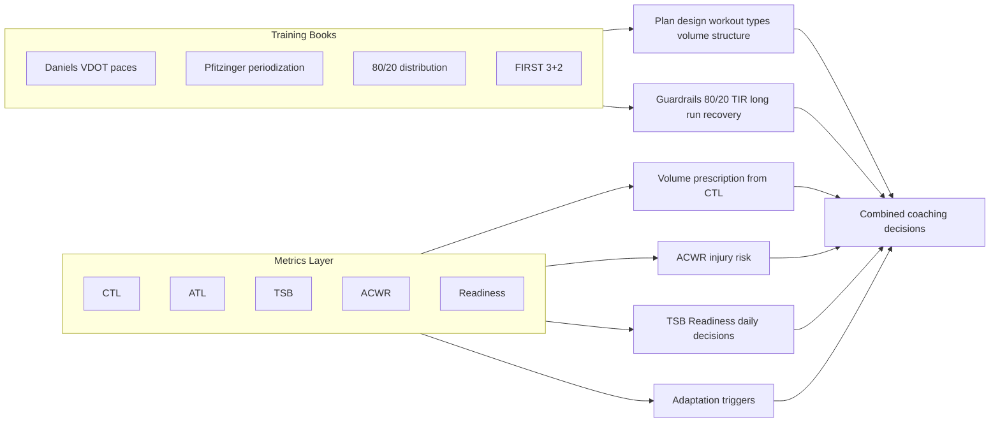

# Sports Coach Engine: Training Methodology (Expert Review Draft)

**Purpose**: This document describes the training methodology currently implemented in Sports Coach Engine, the relationship between classic training literature and the quantitative metrics we use, and open questions for review by a sport coaching expert.

**Audience**: Sport coaching experts, physiologists, and internal reviewers.

**Cross-check**: Definitions, zones, thresholds, guardrails, and adaptation triggers in this document have been verified against [methodology.md](methodology.md) for consistency.

---

## 1. Executive Summary

Sports Coach Engine combines:

- **Training philosophy and workout design** from established running texts: Daniels' Running Formula, Pfitzinger's Advanced Marathoning / Faster Road Racing, Matt Fitzgerald's 80/20 Running, and FIRST (Run Less, Run Faster).
- **Quantitative load and readiness metrics** from the Banister/TrainingPeaks tradition: Chronic Training Load (CTL), Acute Training Load (ATL), Training Stress Balance (TSB), Acute:Chronic Workload Ratio (ACWR), and a composite Readiness score.

The books do **not** define or use CTL/ATL/TSB/ACWR. Those metrics are used by the system to: (1) set appropriate training volume from current fitness (CTL), (2) manage injury risk (ACWR), (3) assess daily readiness and form (TSB, Readiness), and (4) trigger adaptation suggestions (e.g. downgrade or move a workout). The books provide pace zones, periodization, intensity distribution rules (80/20), workout types, and safety guardrails; the metrics layer provides the numbers that drive volume prescription, progression safety, and day-to-day adaptation.

---

## 2. What the Training Books Provide (and Do Not Provide)

### 2.1 Sources

- **Daniels' Running Formula**: VDOT and pace zones (E, M, T, I, R), volume limits for quality work (T ≤10% weekly, I ≤8%/10 km, R ≤5%/8 km), philosophy (consistency, train at current fitness, 3–4 weeks before stress increase).
- **Pfitzinger (Advanced Marathoning / Faster Road Racing)**: Periodization (base → build → peak → taper), long run progression and caps (≤25–30% weekly, ≤2.5 h), recovery weeks (every 4th week ~70% volume), hard/easy principle, workout definitions (LT runs, VO2max intervals, long run, marathon-pace runs).
- **80/20 Running (Matt Fitzgerald)**: Intensity distribution (~80% low, ≤20% moderate+high), avoidance of "moderate-intensity rut," minimum three runs per week when using cross-training, workout constructors (foundation, tempo, intervals, etc.).
- **FIRST (Run Less, Run Faster)**: 3-plus-2 structure (three key runs + cross-training), pace from recent 5K, quality-focused low frequency; used when running 2–3 days/week and for multi-sport volume planning.

### 2.2 What the Books Do NOT Provide

None of these books define or use:

- Chronic Training Load (CTL) or 42-day exponential averages
- Acute Training Load (ATL) or 7-day exponential averages
- Training Stress Balance (TSB)
- Acute:Chronic Workload Ratio (ACWR)
- A composite "readiness" score

Those concepts come from the Banister fitness–fatigue model and its popularization in tools like TrainingPeaks (Performance Management Chart). We use them as a **separate, quantitative layer** on top of the book-based methodology.

---

## 3. Metrics Layer: Origin, Definitions, and Role

### 3.1 Origin

- **CTL, ATL, TSB**: Exponentially weighted moving averages of daily training load, with time constants (e.g. 42 days for CTL, 7 days for ATL). Standard in TrainingPeaks and related literature; see e.g. TrainingPeaks Help (Fitness/CTL, Fatigue/ATL, Form/TSB).
- **ACWR**: Acute (e.g. 7-day) load divided by chronic (e.g. 28-day) load. Used in sports science for injury risk; 1-week acute / 4-week chronic is common; ACWR >1.5 often associated with elevated injury risk in studies.

### 3.2 Definitions in Our System

| Metric        | Definition                                                    | Represents                                  |
| ------------- | ------------------------------------------------------------- | ------------------------------------------- |
| **CTL**       | 42-day EWMA of daily systemic load                            | "Fitness" – aerobic base, training capacity |
| **ATL**       | 7-day EWMA of daily systemic load                             | "Fatigue" – recent training stress          |
| **TSB**       | CTL − ATL                                                     | "Form" – balance of fitness vs fatigue      |
| **ACWR**      | (7-day total systemic load) / (28-day average daily load × 7) | Injury risk from load spikes                |
| **Readiness** | Weighted composite (see below)                                | Daily go/no-go and intensity guidance       |

CTL zones (interpretation): <20 Beginner, 20–35 Recreational, 35–50 Competitive, 50–70 Advanced, >70 Elite.  
TSB zones: <−25 Overreached, −25 to −10 Productive, −10 to +5 Fresh, +5 to +15 Race Ready, >+15 Detraining.  
ACWR: 0.8–1.3 Safe, 1.3–1.5 Caution, >1.5 Danger (injury risk 2–4× baseline in literature).

### 3.3 How We Use These Metrics

- **Plan design**: Starting and target volume are informed by current CTL (e.g. safe volume range from `sce guardrails safe-volume --ctl X`). Goal feasibility (e.g. marathon) can consider CTL and weeks until race.
- **Injury prevention**: ACWR drives adaptation triggers (e.g. ACWR >1.5 → high risk; >1.3 → caution). We do not auto-downgrade; the AI presents options and reasoning.
- **Daily readiness**: TSB and Readiness inform whether to proceed with a quality session, downgrade, or rest. Safety override: ACWR >1.5 and Readiness <35 can force a rest day.
- **Multi-sport**: Two-channel load (systemic vs lower-body) gates running quality/long runs by lower-body load; systemic load feeds CTL/ATL/TSB/ACWR so all sports contribute to fitness and fatigue.

---

## 4. Load Model: Two Channels and Base Effort

### 4.1 Two-Channel Model

- **Systemic load** (`systemic_load_au`): Drives CTL, ATL, TSB, ACWR. All activities contribute via sport-specific multipliers.
- **Lower-body load** (`lower_body_load_au`): Used to gate running quality and long runs (e.g. delay or downgrade if high from prior day/session).

Sport multipliers (examples): Run 1.0/1.0 (systemic/lower-body), Trail 1.05/1.10, Treadmill 1.00/0.90, Cycling 0.85/0.35, Swimming 0.70/0.10, Climbing 0.60/0.10, Strength 0.55/0.40, etc. This allows multi-sport athletes to accumulate systemic load without over-counting leg stress for running decisions.

### 4.2 Base Effort (Implementation vs Documentation)

**Current implementation** (see [sports_coach_engine/core/load.py](../../sports_coach_engine/core/load.py)): Base effort is computed with a **TSS-equivalent** formula aligned with TrainingPeaks/Coggan:

- Formula: `hours × IF² × 100`, where IF (intensity factor) is derived from RPE via a fixed mapping (e.g. RPE 7 → 0.95, RPE 8 → 1.00).
- Example: 60 min at RPE 3 (easy) ≈ 42 AU; 60 min at RPE 8 (threshold) = 100 AU.

**Documentation** ([methodology.md](methodology.md)) has been aligned with implementation: it now describes the TSS-equivalent formula, Coggan/TrainingPeaks reference, and example (60 min RPE 3 ≈ 42 AU, RPE 8 = 100 AU). The Load Calculation section and Validated Examples table in methodology.md match the code.

---

## 5. Data Requirements for Valid Metrics

### 5.1 Minimum History

- **CTL**: Time constant 42 days. TrainingPeaks states that "it takes 42 days to get concrete CTL when starting fresh" and that ~2 months of data is enough for time constants to apply; we also document a **minimum of 12 weeks (84 days)** in [cli_data.md](cli/cli_data.md) for the 42-day CTL calculation to be considered fully valid (conservative).
- **ACWR**: Requires 28 days of load data (7-day acute, 28-day chronic). Our implementation does not compute ACWR when fewer than 28 days of metrics exist.
- **Baseline (M9 spec)**: 14 days for baseline established and relative lower-body thresholds; 28 days for ACWR meaningful; 42 days for CTL stable.

### 5.2 Cold Start

When no prior metrics exist, we can **estimate** initial CTL/ATL from the first N days of load (e.g. average daily systemic load over 7–14 days) and assume steady state (CTL = ATL = that average) to avoid CTL staying at zero for 42 days. This is similar in spirit to TrainingPeaks "Estimate Starting Fitness (CTL)."

### 5.3 Maximum History

No maximum is defined; longer history improves stability of rolling metrics. EWMA naturally down-weights older data.

---

## 6. Readiness Score

### 6.1 Intended Design (Methodology Doc)

When all inputs are available:

- TSB: 20%
- Recent load trend: 25%
- Sleep quality: 25%
- Subjective wellness (e.g. soreness): 30%

Readiness is on a 0–100 scale; <35 "very low" (force rest), 35–50 "low" (downgrade quality), 50–70 "moderate," 70–85 "good," >85 "excellent."

### 6.2 Implementation Note

When subjective data (sleep, wellness) is missing, the implementation uses **objective-only** weights (e.g. TSB 30%, load trend 35%). Methodology doc does not currently describe this fallback; it may be worth documenting and validating with an expert.

---

## 7. Guardrails and Adaptation Triggers

### 7.1 Guardrails (From Books + Evidence)

- 80/20 intensity distribution (Fitzgerald); applies when ≥3 run days/week.
- ACWR safety: ACWR >1.5 treated as high injury risk; enforcement is contextual (AI + athlete decision).
- Long run caps: ≤25–30% of weekly run volume, ≤2.5 h (Pfitzinger).
- Hard/easy: No back-to-back high-intensity (RPE ≥7).
- T/I/R volume limits (Daniels): Threshold ≤10%, Intervals ≤8%, Repetition ≤5% of weekly mileage.
- Recovery weeks: Every 4th week ~70% volume (Pfitzinger).

### 7.2 Adaptation Triggers (M11)

Detected conditions that suggest consideration of a workout change (downgrade, move, skip, or force rest):

| Trigger              | Threshold                  | Typical response            |
| -------------------- | -------------------------- | --------------------------- |
| ACWR_HIGH_RISK       | >1.5                       | Downgrade or skip           |
| ACWR_ELEVATED        | 1.3–1.5                    | Consider downgrade, discuss |
| READINESS_VERY_LOW   | <35                        | Force rest or easy          |
| READINESS_LOW        | <50                        | Downgrade quality           |
| TSB_OVERREACHED      | TSB <−25                   | Reduce load                 |
| LOWER_BODY_LOAD_HIGH | Dynamic (CTL-based)        | Delay quality/long run      |
| SESSION_DENSITY_HIGH | ≥2 hard sessions in 7 days | Space out quality           |

The system returns triggers and risk level; the AI reasons with athlete context and presents options rather than applying automatic workout changes (except for safety overrides such as ACWR >1.5 and Readiness <35).

---

## 8. Relationship Summary: Books vs Metrics

- **Books** → workout types, pace zones, periodization, intensity mix, volume caps, recovery structure.
- **Metrics** → how much volume is safe (CTL), when load is risky (ACWR), how fresh the athlete is (TSB, Readiness), and when to suggest adaptations (triggers).

---

## 9. Potential Issues and Open Questions

This section states **what we do today**, the **source of uncertainty or tension**, and **what would change with expert guidance**. Each item is written so an expert can give a precise, actionable answer.

### 9.1 Base Effort Formula (Resolved)

**What we do**: Base effort is computed as `hours × IF² × 100` (TSS-equivalent), with IF derived from RPE (e.g. RPE 7 → 0.95, RPE 8 → 1.00). [methodology.md](methodology.md) and the code are aligned.

**Status**: Resolved. No open question.

---

### 9.2 Minimum History Before Metrics Are "Valid"

**What we do**: We document **12 weeks (84 days)** as the minimum for the 42-day CTL calculation to be considered fully valid ([cli_data.md](cli/cli_data.md)). We also support baseline estimation from the first 7–14 days of load (steady-state assumption) so CTL does not stay at zero for 42 days. ACWR is not computed until 28 days of metrics exist.

**Tension**: TrainingPeaks states "42 days to get concrete CTL when starting fresh" and "~2 months of data is enough for time constants." Our 12-week minimum is ~2× that. We do not know whether 12 weeks is appropriately conservative for volume prescription and injury-risk messaging, or unnecessarily restrictive for new athletes.

**What we need**: A clear recommendation: (a) minimum days/weeks before **relying on CTL** for starting/target volume (e.g. safe-volume guardrail), and (b) minimum days before **using ACWR** in athlete-facing injury-risk messaging. If different populations (e.g. beginners vs experienced) should have different minimums, that too.

---

### 9.3 Readiness Score: Weights and Fallback When Subjective Data Is Missing

**What we do**: When sleep and wellness are available: TSB 20%, load trend 25%, sleep 25%, wellness 30%. When they are **not** available (common for many users), we use **objective-only** weights: TSB 30%, load trend 35%. Readiness confidence is set to "low" when `data_days < 14`, otherwise "high" (for the objective-only path we do not currently demote confidence when subjective data is missing).

**Tension**: Redistributing to TSB 30% and trend 35% when sleep/wellness are absent may over-weight TSB relative to the intended design. We do not know whether we should: (a) keep this redistribution and document it, (b) label readiness as "low confidence" whenever subjective data is missing and avoid increasing TSB weight, or (c) use a different rule (e.g. cap readiness at a lower max when subjective data is missing).

**What we need**: Whether the objective-only fallback (30% TSB, 35% trend) is appropriate, and whether we should explicitly lower confidence or cap the score when sleep/wellness are unavailable.

---

### 9.4 ACWR: Two Thresholds (1.3 vs 1.5), Rolling vs EWMA, and Messaging

**What we do**: We use **rolling** 7-day acute and 28-day chronic load (sum and average). We expose two thresholds: **1.3** (caution / "elevated"; we set an internal `injury_risk_elevated` flag at ACWR > 1.3) and **1.5** (danger / "high risk"; used for safety overrides and strong messaging). Literature often cites ACWR > 1.5 for elevated injury risk; some work uses EWMA for acute/chronic instead of rolling windows.

**Tension**: (1) Is it correct to use **1.3** as a caution threshold (e.g. for triggers and internal flags) and **1.5** for danger, or should both messaging and logic use a single cutoff? (2) Are rolling 7/28-day windows the right choice for our use case, or should we use an EWMA-based ACWR for consistency with CTL/ATL? (3) What exact wording (e.g. "elevated injury risk" vs "increased load spike") should we use at 1.3 vs 1.5 to avoid over-medicalising or under-playing risk?

**What we need**: Clear guidance on: (a) whether two thresholds (1.3 and 1.5) are justified and how to use each in messaging; (b) rolling vs EWMA for acute/chronic in our context; (c) any evidence or caveats (e.g. sport, population) that should qualify our ACWR messaging.

---

### 9.5 Multi-Sport Load: Systemic and Lower-Body Multipliers

**What we do**: We use a **two-channel** model. Each sport has a **systemic** multiplier (feeds CTL/ATL/TSB/ACWR) and a **lower-body** multiplier (used to gate running quality/long runs). Examples: run 1.0/1.0, trail 1.05/1.10, treadmill 1.0/0.9, cycling 0.85/0.35, swimming 0.70/0.10, climbing 0.60/0.10, strength 0.55/0.40. These were set from first principles and internal consistency, not from published cross-sport load equivalence studies.

**Tension**: We are not aware of published evidence that defines "equivalent" systemic or lower-body load across running, cycling, climbing, etc., for a combined fitness/fatigue model. Our multipliers drive volume prescription (CTL-based safe volume), injury-risk signals (ACWR), and lower-body gating. If multipliers are off, we risk under- or over-counting load for some sports.

**What we need**: (a) Whether these multiplier ranges are plausible for combined CTL/ATL/TSB and for injury-risk decisions; (b) any published or consensus-based values we should align with; (c) which sports (if any) are most uncertain and should be conservative or flagged.

---

### 9.6 TSB Zones and "Race Ready" Wording

**What we do**: We use TSB **+5 to +15** as the "Race Ready" zone (peaked, ready to race). Other sources (e.g. Joe Friel via TrainingPeaks) have been cited for **+15 to +25** as ideal for peak race performance. We do not currently distinguish "good for quality training" (e.g. −10 to +5 "Fresh") from "optimal for race day" in our zone labels.

**Tension**: If +15 to +25 is the evidence-based range for peak performance, our "Race Ready" band (+5 to +15) may be misleading for taper/race planning. We need to know whether to: (a) rename our zone (e.g. "Fresh / good for quality") and add a separate "Peak race" band at +15 to +25, (b) keep +5 to +15 as "Race Ready" and document the Friel range as an alternative view, or (c) adjust the numeric bands and labels on evidence.

**What we need**: Recommended TSB ranges for (i) "productive training" (building), (ii) "fresh enough for key workouts," and (iii) "peak race readiness," with sources or caveats (e.g. distance, athlete level).

---

### 9.7 Two-Channel Lower-Body Gating: Formula and Evidence

**What we do**: We gate running **quality** and **long runs** using **lower-body load** from the last 1–2 days. The threshold is **dynamic**: we use `safe_daily_lower = CTL × 2.5` (over the last 2 days combined). So for CTL 40, we treat ~100 AU lower-body over 2 days as the ceiling before suggesting delay or downgrade. Multi-sport multipliers assign lower-body load (e.g. run 1.0, climbing 0.1, cycling 0.35).

**Tension**: The formula `CTL × 2.5` per 2 days is a heuristic. We are not aware of evidence that defines "safe" lower-body load from running plus other sports for the next day’s run. If the multiplier or the 2-day window is wrong, we may be too conservative (blocking good sessions) or too aggressive (allowing excessive cumulative leg stress).

**What we need**: (a) Whether the concept—separate lower-body load to gate running quality/long runs in multi-sport athletes—is supported by evidence or expert practice; (b) whether a CTL-scaled threshold (and if so, what form) is reasonable; (c) any better way to operationalise "leg stress from non-running" for run prescription.

---

### 9.8 Recovery Weeks and CTL

**What we do**: We apply **recovery weeks** from Pfitzinger: every 4th week at ~70% volume during base/build. We do **not** explicitly link recovery weeks to CTL/ATL/TSB (e.g. we do not enforce "no CTL ramp" or "target TSB rise" in that week). Periodization is calendar-based (week 4, 8, 12, …).

**Tension**: If recovery weeks are meant to consolidate adaptation, one might expect CTL to plateau or dip and TSB to rise. We could use metrics to (a) validate that a week was actually "recovery" (e.g. ACWR and load trend), or (b) warn when an athlete is still ramping load in a planned recovery week. We do not know if that linkage is necessary or if calendar-based recovery is sufficient.

**What we need**: Whether recovery weeks should be explicitly tied to load metrics (e.g. no CTL ramp, or ACWR/load trend checks), or whether calendar-based recovery is sufficient for our population.

---

### 9.9 RPE-to-IF Mapping for TSS-Equivalent Load

**What we do**: We map RPE (1–10) to intensity factor (IF) for the formula `hours × IF² × 100`. Example mapping: RPE 3 → 0.65, RPE 5 → 0.82, RPE 7 → 0.95, RPE 8 → 1.00, RPE 10 → 1.10. This is fixed in code; we do not calibrate per athlete.

**Tension**: RPE is subjective and athlete-dependent. A single mapping may over- or under-estimate load for some athletes (e.g. those who rate effort high or low). We use this for **all** sports (running, cycling, climbing, etc.); the same RPE in different activities might not imply the same relative intensity.

**What we need**: (a) Whether a single RPE→IF mapping is acceptable for cross-sport load when power/HR are unavailable; (b) whether key anchors (e.g. RPE 7–8 = threshold) are in line with common practice; (c) any simple calibration or caveats we should surface to users.

---

## 10. Questions for Sport Coaching Expert

The following questions are designed to yield **precise, actionable guidance**. For each we state **context**, **our current choice**, and the **specific ask**. Where we suggest optional answers (e.g. A/B/C), please choose, refine, or replace with your own; we need clear recommendations and, where possible, sources or caveats so we can update our methodology and implementation with confidence.

---

### Q1. Combining Book-Based Methodology With CTL/ATL/TSB/ACWR

**Context**: Our workout design, periodization, and guardrails come from Daniels, Pfitzinger, 80/20, and FIRST. None of these books use CTL, ATL, TSB, or ACWR. We layer those metrics on top to set volume (CTL), injury risk (ACWR), and daily readiness (TSB, Readiness).

**Current choice**: We use the books for *what* to do (workout types, phases, intensity mix, caps) and the metrics for *how much* and *when* (volume prescription, load spikes, readiness).

**Ask**: Is this combination methodologically sound? If not, what would you change: (A) keep both layers as-is and document the split clearly, (B) reduce reliance on metrics until more evidence (e.g. for multi-sport), (C) align metrics with book language where possible (e.g. avoid "CTL" in athlete-facing text and use "fitness" or "training load"), or (D) something else? Please cite any sources that support or caution against this hybrid.

---

### Q2. Minimum History Before Using CTL and ACWR in Decisions

**Context**: We need clear rules for **new athletes** (or those with little history): when can we safely use CTL for volume prescription (e.g. safe-volume range) and ACWR for injury-risk messaging?

**Current choice**: We document 12 weeks (84 days) as minimum for CTL to be "valid"; we do not compute ACWR until 28 days of metrics. We also support baseline estimation from 7–14 days so CTL is not zero for 42 days.

**Ask**: (a) What **minimum number of days or weeks** would you recommend before **relying on CTL** for starting/target weekly volume (e.g. guardrails that recommend km/week from CTL)? (b) What minimum before **using ACWR** in athlete-facing injury-risk messaging? (c) Should these minimums differ by population (e.g. beginners vs experienced, single-sport vs multi-sport)? Please give specific numbers and, if possible, a brief rationale or source.

---

### Q3. Load Formula for Cross-Sport Combined Load

**Context**: We combine load from running, cycling, climbing, swimming, etc., into one CTL/ATL/TSB stream. We use an RPE-based TSS-equivalent: `hours × IF² × 100`, with IF from a fixed RPE→IF table (e.g. RPE 8 = 1.0). We do not have power or HR-based TSS for most activities.

**Current choice**: This formula is used for all sports, then multiplied by sport-specific systemic/lower-body multipliers.

**Ask**: (a) Is the RPE-based TSS-equivalent **appropriate** for combining running with cycling, climbing, swimming, etc., into a single fitness/fatigue model? (b) Would you prefer a different normalization (e.g. session RPE only, or sport-specific formulas)? (c) Any caveats we should show to athletes (e.g. "Load from other sports is estimated from effort and duration")? Please be specific.

---

### Q4. Multi-Sport Systemic and Lower-Body Multipliers

**Context**: We use multipliers so that 60 min run at RPE 6 ≠ 60 min climb at RPE 6 in terms of systemic and lower-body load. Examples: run 1.0/1.0, cycling 0.85/0.35, climbing 0.60/0.10, swimming 0.70/0.10 (systemic/lower-body).

**Current choice**: Values are set from first principles and internal consistency; we are not aware of published equivalence tables for these sports in a combined model.

**Ask**: (a) Are these **ranges** (e.g. cycling systemic 0.8–0.9, lower-body 0.3–0.4; climbing systemic 0.5–0.7, lower-body 0.05–0.15) plausible for combined CTL/ATL/TSB and for injury-risk decisions? (b) Is there any **published or consensus** set of relative load (or "training stress" equivalence) we should align with? (c) Which sports, if any, are most uncertain and should be treated conservatively or flagged in the UI?

---

### Q5. ACWR: Thresholds (1.3 vs 1.5), Rolling vs EWMA, and Wording

**Context**: We use **rolling** 7-day and 28-day load. We have two cutoffs: **1.3** (caution; we set an internal "elevated" flag and may suggest modifications) and **1.5** (danger; we may force rest when combined with very low readiness).

**Current choice**: Two thresholds as above. Rolling windows. We message "caution" at 1.3 and "high injury risk" at 1.5.

**Ask**: (a) Do you support **two** thresholds (1.3 and 1.5) for our use case, and how would you use each in **wording** (e.g. "elevated load" vs "high injury risk")? (b) Should we use **rolling** 7/28 days or an **EWMA**-based acute/chronic for consistency with CTL/ATL? (c) Any **evidence or caveats** (sport, level, age) that should qualify our ACWR messaging? Please give concrete wording or formula changes if possible.

---

### Q6. TSB Ranges for Training vs Race Readiness

**Context**: We label TSB +5 to +15 as "Race Ready." Some sources (e.g. Friel) cite +15 to +25 for peak race performance. We want to avoid misleading athletes in taper/race planning.

**Current choice**: Zones: <−25 Overreached, −25 to −10 Productive, −10 to +5 Fresh, +5 to +15 Race Ready, >+15 Detraining.

**Ask**: (a) What TSB **ranges** would you use for: (i) "productive training" (building), (ii) "fresh enough for key workouts," and (iii) "peak race readiness"? (b) Should we **rename** our +5 to +15 zone (e.g. "Fresh / good for quality" or "Approaching race ready") and add a separate "Peak race" band (e.g. +15 to +25)? (c) Any **sources** (e.g. Friel, TrainingPeaks) we should cite or align with? Please give numeric ranges and preferred labels.

---

### Q7. Readiness Score: Design and Fallback When Subjective Data Is Missing

**Context**: Readiness is 0–100 from TSB (20%), load trend (25%), sleep (25%), wellness (30%). Many users do not log sleep or wellness; we then use **objective-only**: TSB 30%, load trend 35%. We do not currently lower confidence or cap the score when subjective data is missing.

**Current choice**: Full weights when all data present; 30/35 objective-only when sleep/wellness absent. Confidence "low" only when `data_days < 14`.

**Ask**: (a) Is a **single** 0–100 Readiness score (with these components) **useful** for daily prescription (go/no-go, downgrade quality)? (b) Is the **20/25/25/30** split reasonable when all data are present? (c) When subjective data is **missing**, is **redistributing** to TSB 30% and trend 35% appropriate, or should we (i) label confidence "low" and/or (ii) cap the score (e.g. max 70) to reflect uncertainty? Please be specific.

---

### Q8. Safety Override: Forcing Rest When ACWR >1.5 and Readiness <35

**Context**: We have one **automatic** safety override: when **ACWR > 1.5** and **Readiness < 35**, we force a rest day (no athlete choice). All other triggers (e.g. ACWR 1.4, readiness 40) are advisory: we present options and the athlete decides.

**Current choice**: Only the combination ACWR >1.5 and Readiness <35 triggers a mandatory rest day.

**Ask**: (a) Is it **appropriate** to **force** a rest day in this specific situation, or would you recommend all decisions remain advisory (with strong recommendation)? (b) If you support a hard override, is **ACWR > 1.5 and Readiness < 35** the right rule, or would you use different thresholds (e.g. ACWR > 1.8, or Readiness < 30)? Please give a clear yes/no on override and, if yes, exact thresholds.

---

### Q9. Two-Channel Lower-Body Gating for Multi-Sport Athletes

**Context**: We delay or downgrade running **quality** and **long runs** when **lower-body load** in the last 1–2 days exceeds a **CTL-based** threshold: `safe_daily_lower = CTL × 2.5` (over 2 days). Lower-body load comes from sport multipliers (e.g. run 1.0, climb 0.1, cycle 0.35).

**Current choice**: Dynamic threshold CTL × 2.5 per 2 days; same logic for all multi-sport athletes.

**Ask**: (a) Is the **concept**—using a separate "lower-body" load to gate running quality/long runs when athletes do other sports—**supported** by evidence or expert practice? (b) Is a **CTL-scaled** threshold (e.g. CTL × 2.5 over 2 days) a reasonable form, or would you use a different formula or window? (c) Any **better way** to operationalise "leg stress from non-running" for run prescription (e.g. different multipliers, or separate rules per sport)? Please be concrete.

---

### Q10. Recovery Weeks: Link to Load Metrics or Calendar Only?

**Context**: We apply recovery weeks every 4th week at ~70% volume (Pfitzinger). We do **not** currently use CTL/ATL/ACWR to enforce or validate "recovery" (e.g. no rule that CTL must not rise in that week).

**Current choice**: Purely calendar-based (weeks 4, 8, 12, …).

**Ask**: (a) Should recovery weeks be **explicitly tied** to load metrics—e.g. "no CTL ramp in recovery week," or "ACWR must not exceed X in recovery week"—or is **calendar-based** recovery sufficient for our context? (b) If tied to metrics, what **exact rule** would you use (e.g. target TSB rise, or cap on weekly load change)? Please give a clear recommendation and, if possible, a simple rule we could implement.

---

## 11. References (Internal)

- [methodology.md](methodology.md) – Training methodology reference
- [docs/specs/modules/m08_load_engine.md](../specs/modules/m08_load_engine.md) – Load calculation (M8)
- [docs/specs/modules/m09_metrics_engine.md](../specs/modules/m09_metrics_engine.md) – Metrics (M9), cold start, baseline
- [cli_data.md](cli/cli_data.md) – CTL baseline requirements (12 weeks)
- [sports_coach_engine/core/load.py](../../sports_coach_engine/core/load.py) – Base effort TSS formula
- [sports_coach_engine/core/metrics.py](../../sports_coach_engine/core/metrics.py) – CTL/ATL/TSB/ACWR/Readiness
- [sports_coach_engine/core/guardrails/volume.py](../../sports_coach_engine/core/guardrails/volume.py) – Safe volume range by CTL
- [sports_coach_engine/schemas/adaptation.py](../../sports_coach_engine/schemas/adaptation.py) – Trigger types and thresholds
